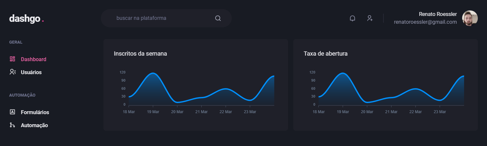
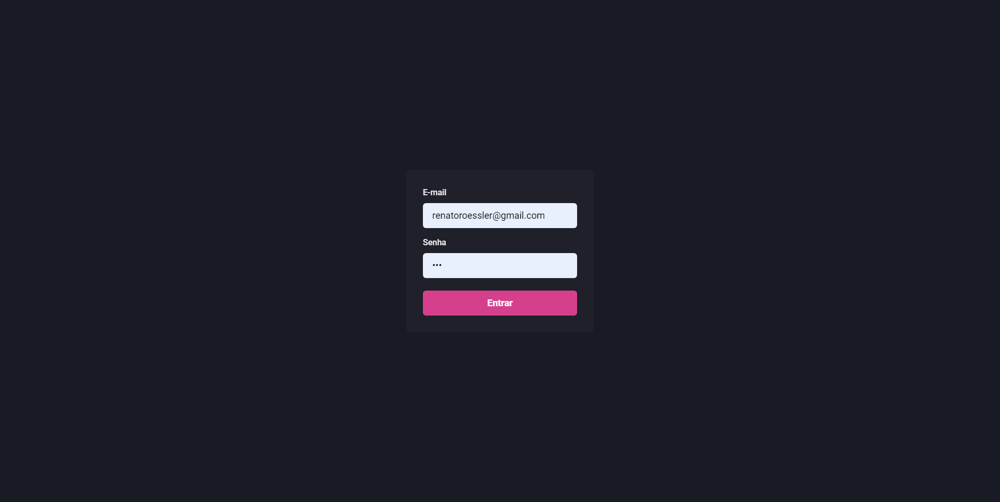
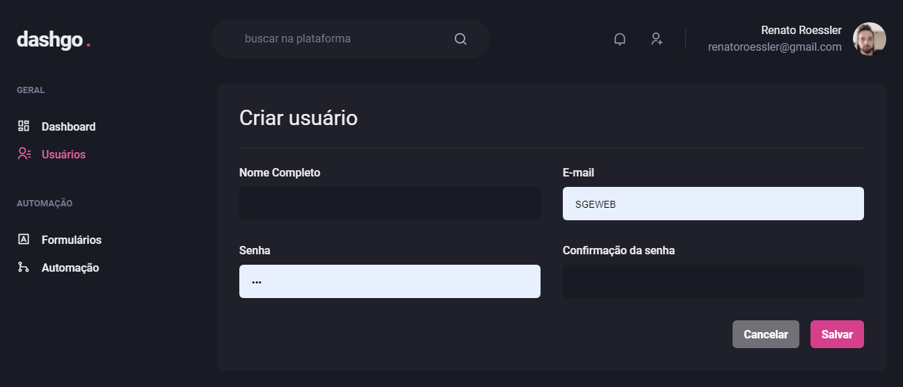
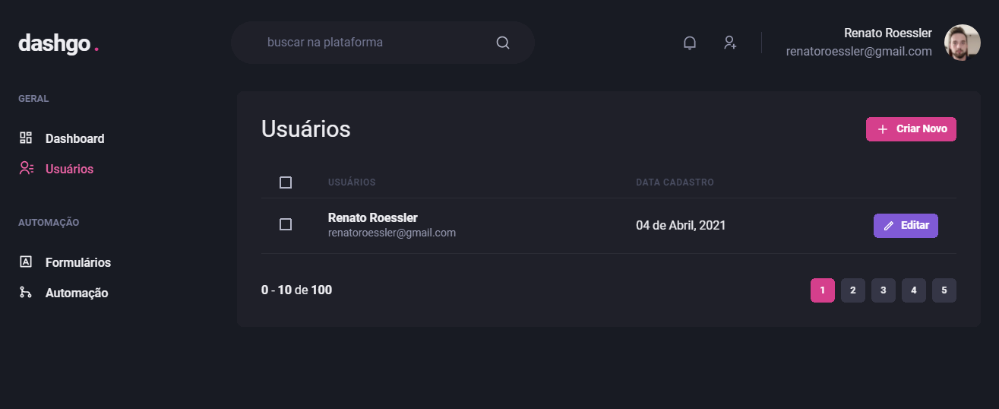
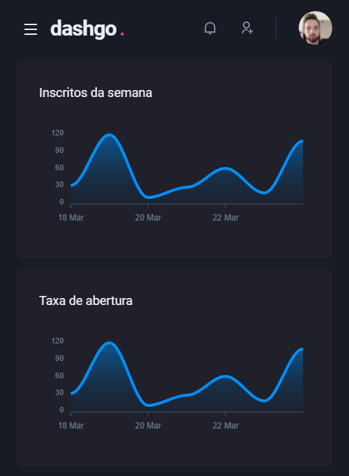
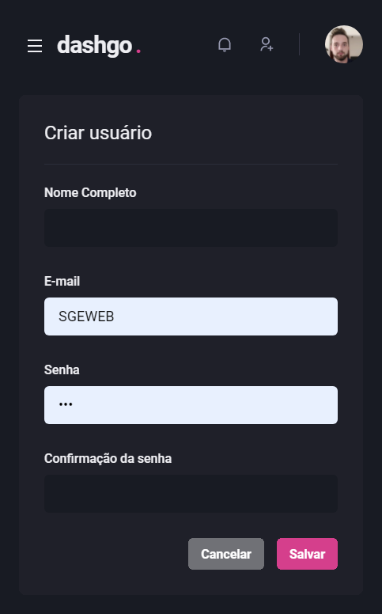
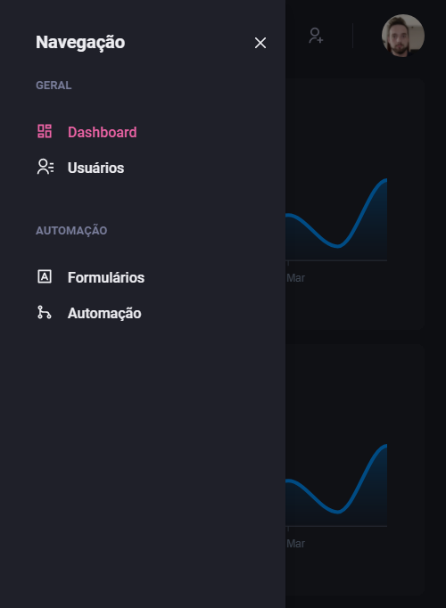

  

  

  

  <a href="https://github.com/renatoroessler">
  <a>

    
  ## Description
- Dashboard application created in Ignite Bootcamp
    
  ## Features 🚀
 - Typescript
 - React + Next.js
 - React hook form
 - Styling using Chakra-ui
 - React context api
    
    ## Screens 💻

 <h4>Home</h4>
    
    
 <h4>Login</h4>
     
  
<h4>Create new User form</h4>
    
    
<h4>Users table</h4>
    
    
 ## Responsive 📱

<h4>Home</h4> 
    

<h4>Create new User form</h4>   

 <h4>Users table</h4>  
 

   <h4>menu</h4>   
    

## Contact ✉

- <a target="_blank" href="https://www.linkedin.com/in/renato-roessler-9b0b786b/">LinkedIn</a>
- <a target="_blank" href="mailto:renatoroessler@gmail.com">E-mail</a>
